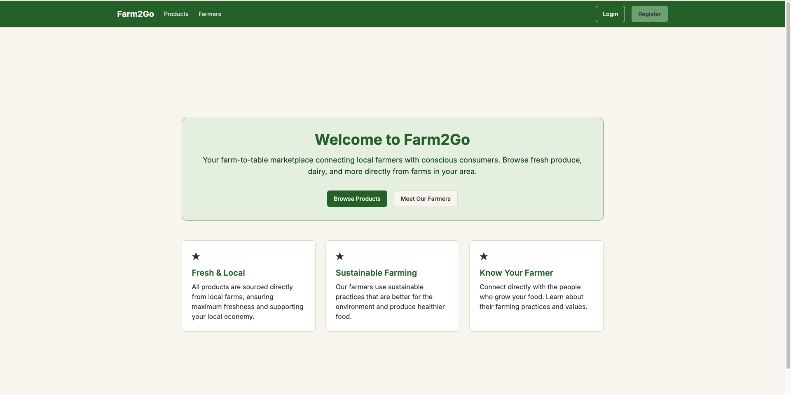
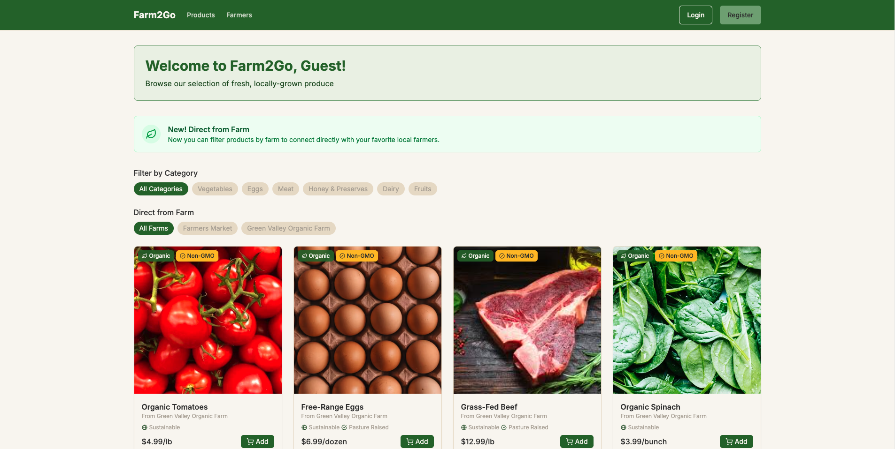
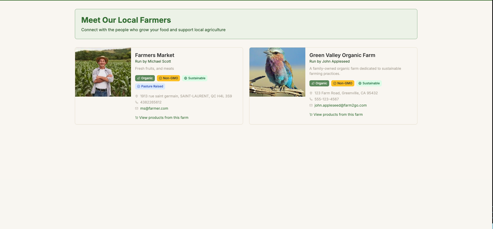
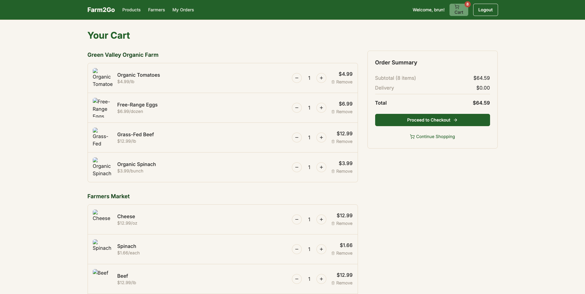
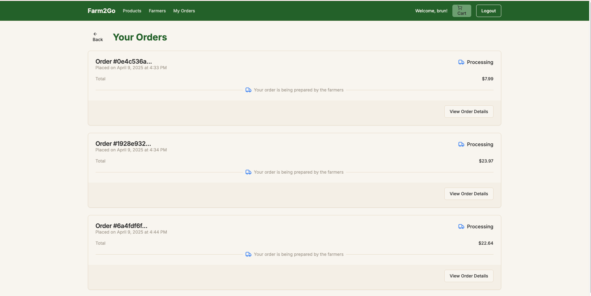
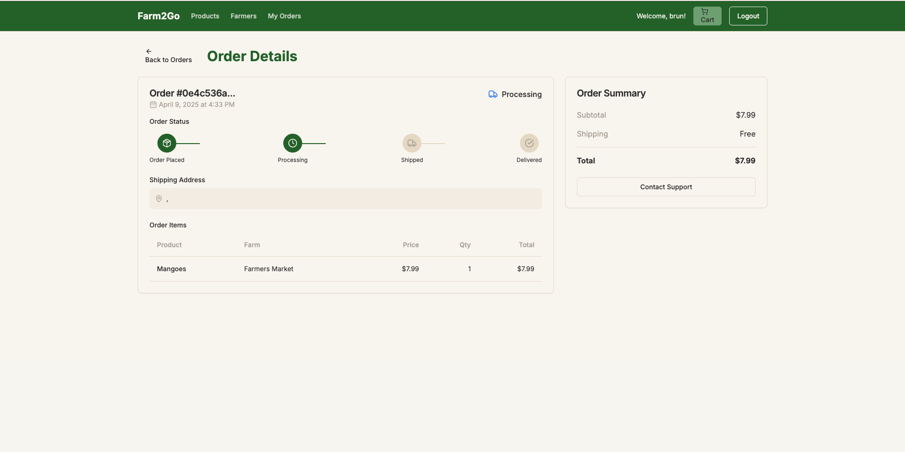
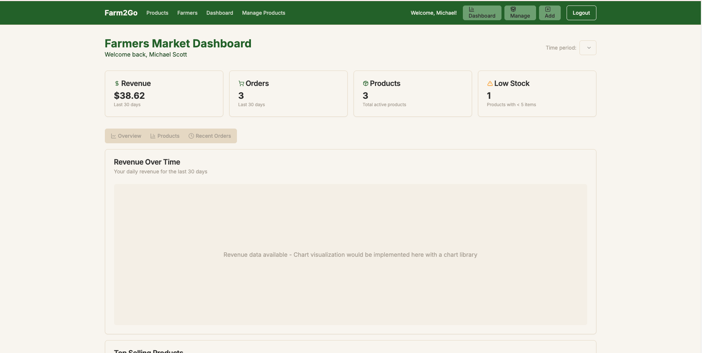
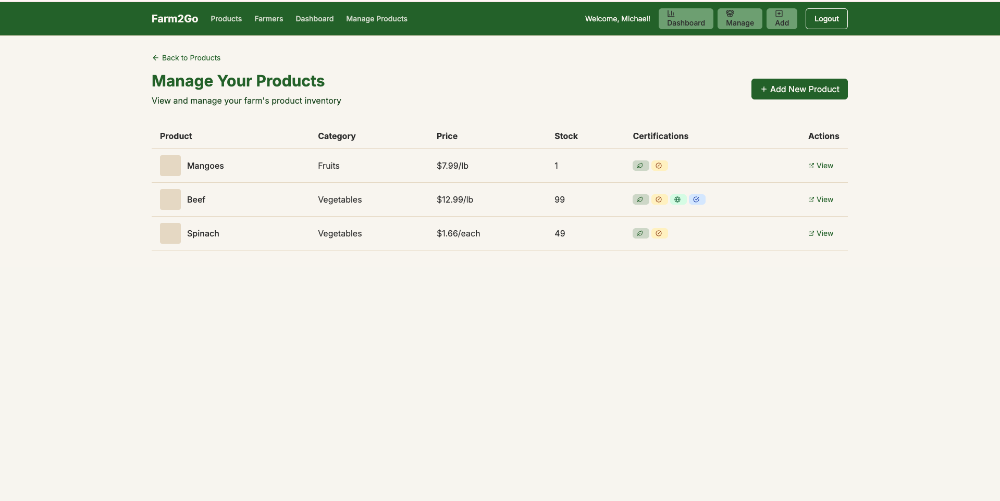

# Farm2Go

A farm-to-table marketplace connecting local farmers directly with conscious consumers, built with Next.js, ShadcnUI, Tailwind CSS, and SQLite.

## Overview

Farm2Go is a platform designed to:

- Help local farmers sell their products directly to consumers
- Provide consumers with fresh, locally-grown produce
- Promote sustainable farming practices and transparency
- Support the local economy and reduce food miles

## Setup Instructions

1. Install dependencies:

```bash
npm install
```

2. Run the development server:

```bash
npm run dev
```

3. Open [http://localhost:3000](http://localhost:3000) with your browser to see the result.

## Project Structure

```
src/
├── app/
│   ├── api/            # API routes
│   ├── cart/           # Shopping cart functionality
│   ├── dashboard/      # Farmer analytics dashboard
│   ├── farmers/        # Farmer listings
│   ├── login/          # Authentication
│   ├── orders/         # Order tracking and history
│   ├── products/       # Product listings
│   ├── register/       # User registration
│   ├── globals.css
│   ├── layout.tsx
│   └── page.tsx
├── components/
│   ├── layout/         # Layout components like navbar
│   └── ui/             # Reusable UI components
└── lib/
    ├── context/        # React context providers
    ├── db/             # Database setup and schema
    └── utils.ts        # Utility functions
```

## Features

### For Consumers:

- Browse products from local farmers
- Filter by category, farm, and certifications
- Add items to cart and checkout
- Order tracking system with status updates
- View order history and details

### For Farmers:

- Comprehensive dashboard with sales analytics
- Inventory management tools
- Order fulfillment tracking
- Revenue metrics and insights
- Product listing management

### General Features:

- Authentication for both farmers and consumers
- Responsive design for all devices
- Real-time cart management
- Multiple payment options (simulated)
- Sustainability indicators

## Technology Stack

- **Frontend Framework**: Next.js 14 - Used for its fast performance, SEO optimization, and API integration capabilities, enabling server-side rendering and eliminating the need for a separate backend service
- **UI Library**: React 18 - Powers the interactive components with efficient rendering using the latest features
- **Type Safety**: TypeScript - Provides static type checking to improve code quality and developer experience
- **Styling**:
  - Tailwind CSS - Used for rapid responsive design with utility-first classes that enhance maintainability
  - class-variance-authority - Enables type-safe component variants with conditional styling
- **UI Components**: ShadcnUI - Offers accessible, customizable components that integrate seamlessly with Tailwind and Next.js
- **Database**:
  - SQLite - Lightweight, serverless database perfect for local development
  - Drizzle ORM - Type-safe ORM for database interactions with minimal overhead
- **Authentication**: Custom JWT-based auth system with secure token handling
- **Icon Library**: Lucide React - Provides consistent, customizable icons throughout the interface
- **Date/Time Management**: date-fns - Lightweight date manipulation library for order tracking and analytics
- **State Management**: React Context API - For managing global application state like cart, user preferences
- **API Architecture**: REST APIs with Next.js API routes for data operations
- **Form Handling**: React Hook Form - For efficient, performant form validation and submission

## Screenshots

### Homepage



### Products Page



### Farmers Listing



### Shopping Cart



### Checkout Process



### Order Tracking



### Farmer Dashboard



### Analytics




## License

MIT
